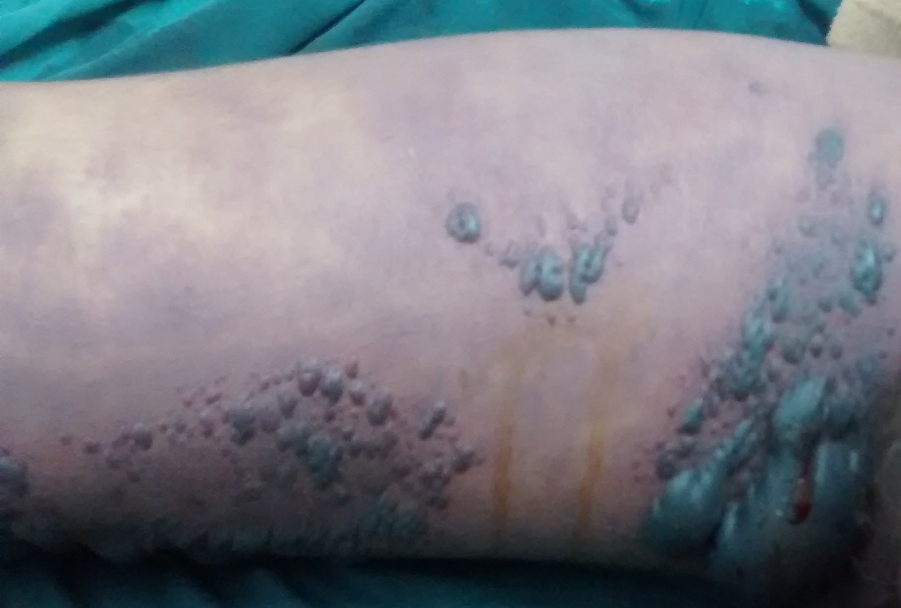
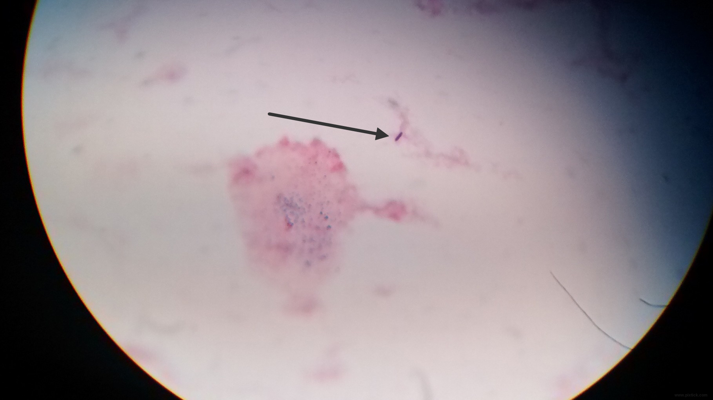

#### A 16 year old girl with fever and hepatitis.

A 16 year old girl presented with high grade fever, skin rash and cervical lymphadenopathy since 2 weeks. She was seen in another hospital where workup for hepatitis (Hepatitis A, B, C,and E), leptospirosis, malaria, and rickettsial disease was non-conclusive. Broad spectrum antibiotics were initiated (ceftriaxone, piperacillin-tazobactam, doxycycline, amikacin). However symptoms persisted.

At presentation, the patient was febrile and had tachycardia. Blood pressure was stable. A macular erythematous rash was seen over the trunk and limbs. No eschars were seen. Cervical non-tender lymph nodes were palpable. Respiratory examination was normal, and abdominal examination revealed right hypochondrial tenderness. Review of results from previous hospital showed anemian (Hb 9.2), a normal leucocyte and platelet count. The ALT/AST were 272/244 IU respectively with a serum bilirubin of 2.8 mg/dl. INR was 1.4. Serum creatinine was 0.9 mg/dl. Chest radiograph was normal. Blood cultures were sterile. HIV, EBV and CMV antibodies were negative.

The patient's mother described hypopigmented patches over the cheek and right shoulder since 3 years. A skin biopsy had revealed borderline tuberculoid leprosy ~1 month prior. Dapsone 100 mg/day was started and continued till ~1 week prior to presentation at this hospital.

Dapsone hypersensitivity syndrome was diagnosed. The patient was started on prednisolone 40 mg/day. Transient clinical improvement was noted, however symptoms recurred over the next 5 days with tachycardia, hypotension and worsening hepatic function. Imipenem-cilastatin was administered.  Intravenous methyl prednisolone was started at 250 mg/day for 3 days followed by tapering doses, with dramatic clinical improvement and resolution of rash, lymphadenopathy and hepatic dysfunction. However hospital course was complicated by transfusion associated lung injury / ARDS requiring mechanical ventilation for 5 days.

Oral prednisolone was continued in tapering doses, with patient remaining free of symptoms.

**Dapsone Hypersensitivity Syndrome**

---------------------------------------

#### A 20 year old man with buttock pain

A 20 year old man went to his general practitioner with symptoms of fever, malaise and coryza. Symptomatic treatment was advised and intramuscular diclofenac was administered in the right buttock. The patient developed pain in the right buttock next day and was admitted in the evening to another hospital, where local cellulitis at the injection site was diagnosed. Broad spectrum antibiotics (piperacillin-tazobactam, metronidazole, amikacin) were administered.

However over the next few hours, pain worsened and area of cellulitis extended. Crepitus was noted. The patient was transferred to this hospital for further management.

At admission, the patient was hypotensive, and tachypneic. Extensive areas of necrotic skin with blebs were noted over the right buttock, right thigh and lower abdomen. Extensive crepitus was noted over the abdomen, chest and lower limbs. Meropenem, vancomycin, penicillin G and clindamycin were administered. Urgent surgical debridement was planned; however patient developed intractable hypotension and cardiac arrest, and could not be revived despite resuscitation efforts.

A gram stain of the serosanguineous aspirate from skin bleb on the thigh showed sparse gram positive bacilli.

**Clostridial Gas Gangrene (Myonecrosis)**

----------------------------------------
