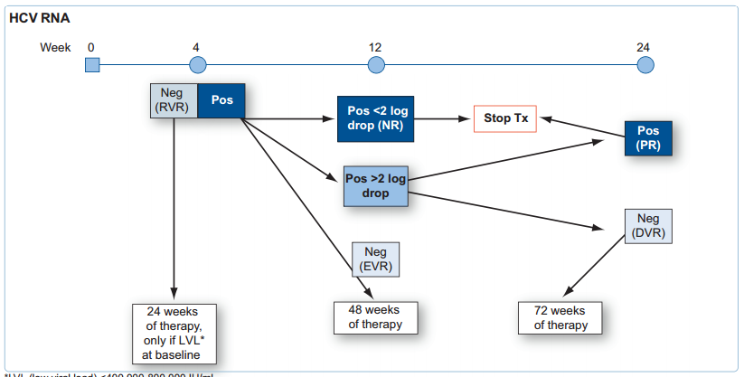

#### Treatment of Extended Spectrum Beta Lactamases

**Paterson, D. L. et al. Outcome of Cephalosporin Treatment for Serious Infections Due to Apparently Susceptible Organisms Producing Extended-Spectrum -Lactamases: Implications for the Clinical Microbiology Laboratory. Journal of Clinical Microbiology 39, 2206–2212 (2001)** [Pubmed] (http://www.ncbi.nlm.nih.gov/pubmed/11376058)

High mortality with use of cephalosporins in patients with ESBL infections when cephalosporin MIC > 1 mg/L

-------------------------

**EASL guidelines for Hepatitis C**

